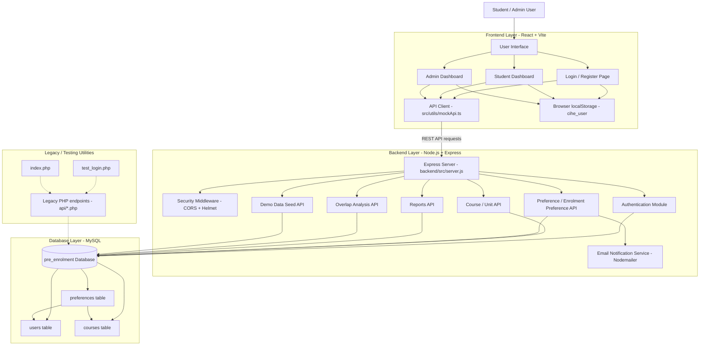
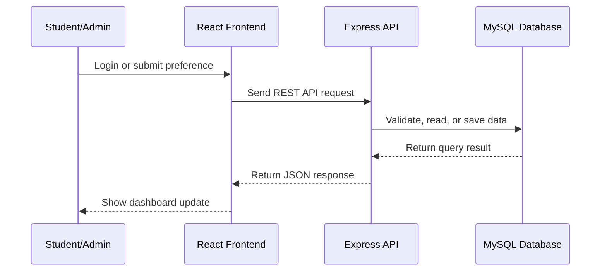

# CIHE Pre-Enrolment System Architecture

This document explains the main architecture of the CIHE Pre-Enrolment System.
The current primary runtime uses a React frontend, a Node.js/Express backend,
and a MySQL database. Some PHP files remain in the repository as legacy or
testing utilities.

## High-Level Architecture

## Main Components

- Frontend: React and Vite provide the student and admin user interfaces.
- API client: `src/utils/mockApi.ts` sends REST requests to the backend.
- Backend: `backend/src/server.js` handles authentication, courses,
  preferences, reports, overlap analysis, and demo data seeding.
- Database: MySQL stores users, courses, and student preference submissions.
- Email service: Nodemailer can notify students when preferences are approved
  or rejected.

## Main Data Flow

## Short Explanation

The system follows a three-layer architecture. The React frontend handles the
screens for students and admins. The Express backend handles business logic and
connects to MySQL. The database stores user accounts, available units, and
student pre-enrolment preferences. Admin reporting and overlap analysis use the
stored preference data to help with timetable planning.
